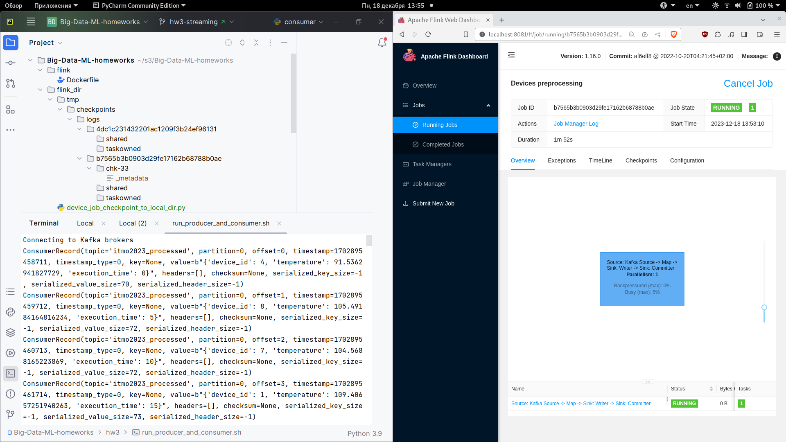

Основной файл решения: [device_job.py](../device_job.py)

# Подготовка

```bash
docker compose build
docker compose up -d
docker compose exec kafka kafka-topics.sh --bootstrap-server kafka:9092 --create --topic itmo2023 --partitions 2 --replication-factor 1
```

Файл device_job.py нужно переместить в flink_dir/

# Чекпоинт в локальной файловой системе

Команда для смены прав на директорию с чекпоинтами в случае запуска на
локальной файловой системе:

```bash
docker compose exec jobmanager bash -c "chown -R flink:flink /opt/pyflink && chmod 755 /opt/pyflink"
```

Необходимо запустить flink-джобу, а также продьюсера и консьюмера:

```bash
docker compose exec jobmanager ./bin/flink run -py /opt/pyflink/device_job.py -d
bash run_producer_and_consumer.sh
```

Скриншот файлов с чекпоинтом:


# Чекпоинт в hdfs

Для этой части задания docker compose нужно запускать с hdfs:
```bash
docker compose --file docker-compose_hdfs.yaml up
```

Команда запуска flink-джобы становится другой, поскольку я решил запускать
flink на yarn, дело в том, что при запуске без yarn все время возникала
ошибка "Hadoop is not in the classpath/dependencies", и я решил что запуск
через yarn - наиболее удачное решение данной проблемы в рамках выполнения
задания:

```bash
docker compose exec jobmanager bash -c "export HADOOP_CLASSPATH=\`hadoop classpath\` && ./bin/yarn-session.sh --detached && ./bin/flink run -py /opt/pyflink/device_job.py -d"
bash run_producer_and_consumer.sh
```

Скриншот файлов с чекпоинтом:
